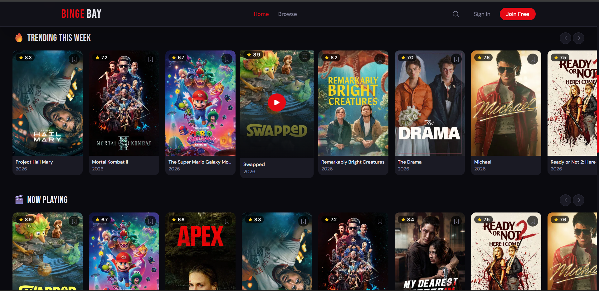
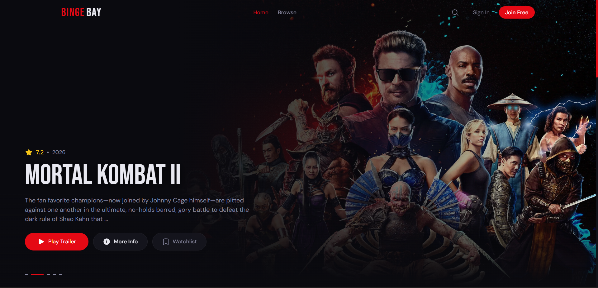
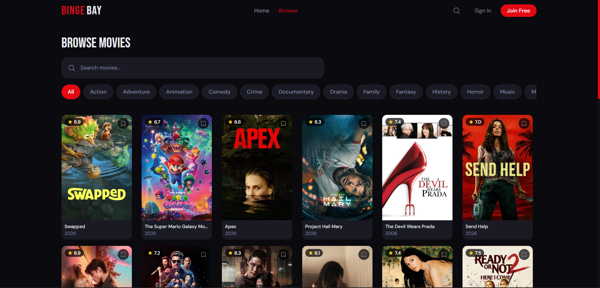
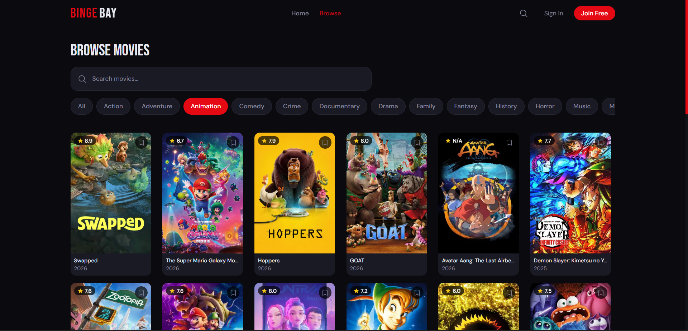
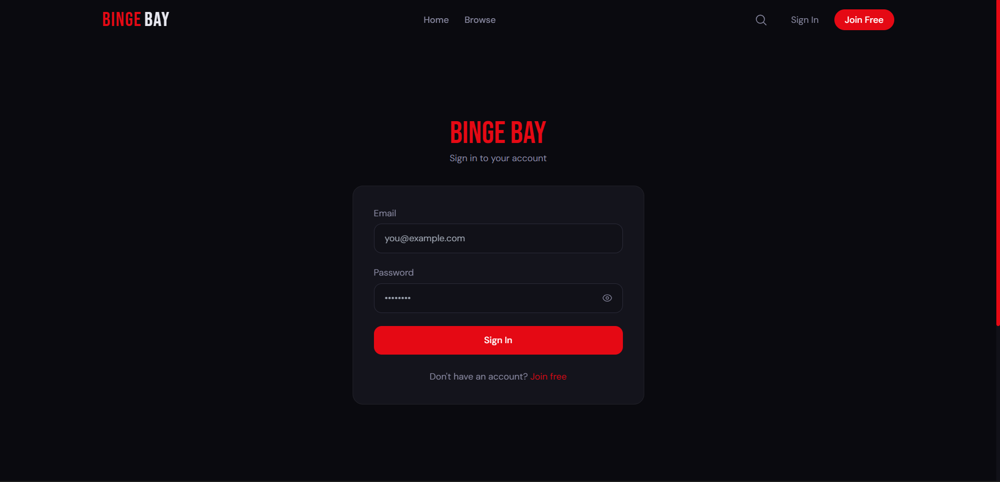
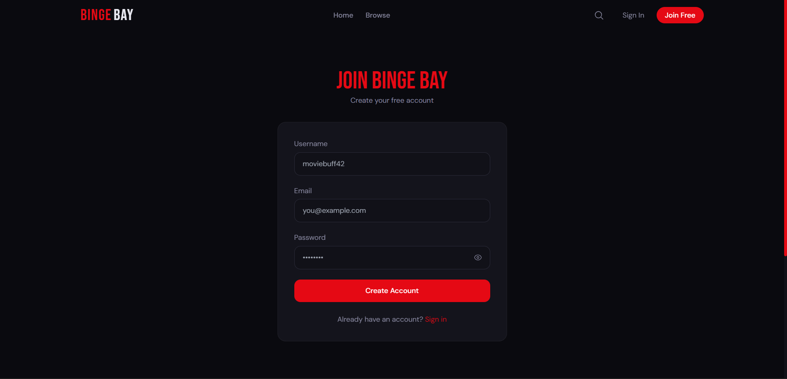
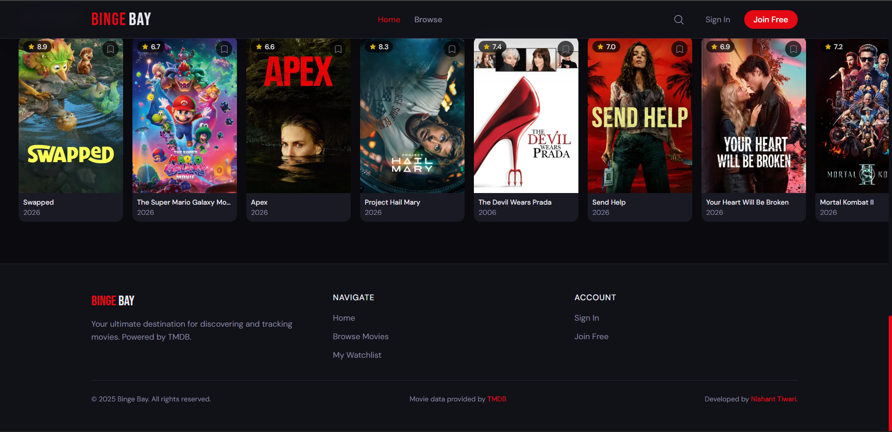

# 🎬 Binge Bay

A full-stack movie streaming web app for discovering and tracking movies,
built as a personal project to learn full-stack development.

## ✨ Features

- 🎬 Browse Trending, Popular, Top Rated & Now Playing movies
- 🔍 Real-time movie search with genre filters
- 🎞️ Watch YouTube trailers directly in the app
- 🔖 Personal watchlist (save & remove movies)
- 🔐 User authentication with JWT
- 📱 Fully responsive modern UI

## 🛠️ Tech Stack

| Layer | Technology |
|-------|-----------|
| Frontend | React.js, Tailwind CSS, Framer Motion |
| Backend | Java Spring Boot, Spring Security |
| Database | PostgreSQL | -> Supabase |
| Auth | JWT (JSON Web Tokens) |
| Movie Data | TMDB API |

## 📁 Project Structure
```
Binge_Bay/
├── binge-bay-backend/    ← Spring Boot REST API
└── binge-bay-frontend/   ← React Application
```

## ⚙️ Prerequisites

If you want to explore or build something similar, here's what you'll need:

- Node.js 18+
- Java JDK 17+
- MySQL 8.0+
- A free TMDB API Key from [themoviedb.org](https://www.themoviedb.org/settings/api)
- IntelliJ IDEA (for backend)
- VSCode (for frontend)

## 🔑 Environment Configuration

This project requires environment-specific configuration that is 
intentionally not included in this repository for security reasons.

**Backend** — you will need to create your own 
`src/main/resources/application.properties` with:
- Your MySQL database credentials
- Your TMDB API key
- A JWT secret key

**Frontend** — you will need to create your own `.env` file with:
- Your backend API URL
- TMDB image base URL

## 📸 Screenshots
### 🏠 Home Page


---

### 🎬 Hero Section


---

### 🔍 Browse Movies


---

### 🎭 Browse By Genre


---

### 🔎 Search Feature


---

### 🔐 Login Page


---

### 📝 Register Page


---

### 🦶 Footer


---

> Built with ❤️ by [Nishant Tiwari](https://github.com/Nishant-2608)  
> Movie data provided by [TMDB](https://www.themoviedb.org/)